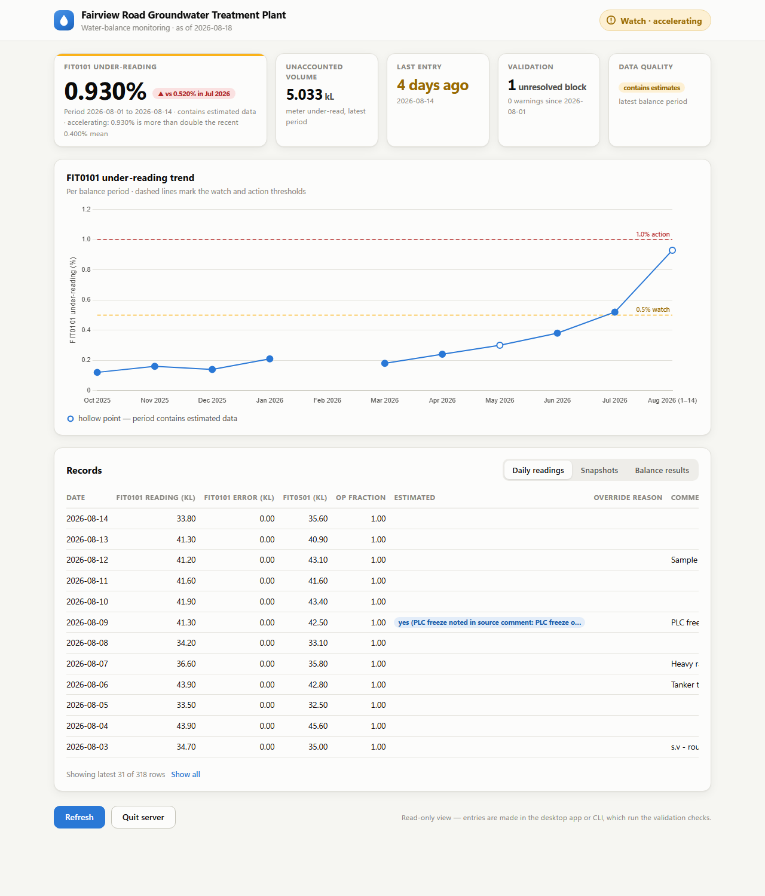
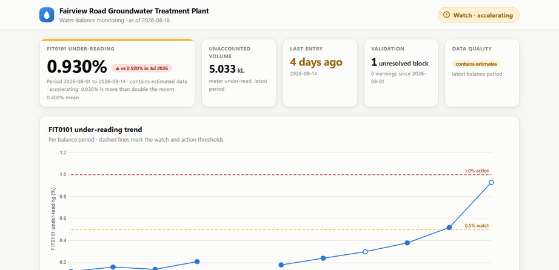

# GTP Monitor

A monitoring tool for a groundwater treatment plant: it stores daily water
volumes, computes a monthly **water balance**, validates every entry
against 13 rules, and raises an alert when the plant's inflow flowmeter
starts drifting out of agreement with reality.



## The story

A treatment plant pumps contaminated groundwater from a ring of extraction
wells, treats it, and discharges it to sewer. Two flowmeters bracket the
process. For years the daily readings lived in a hand-maintained Excel
workbook, and the one question that matters — *is the inflow meter still
telling the truth?* — took a spreadsheet archaeologist to answer.

This tool replaces that workbook. Every month it closes the books on the
plant's water: what came in, what went out, what sat in the tanks, what
the process itself added. Whatever doesn't balance is the **unaccounted
volume** — and when that number grows month over month, a meter is wearing
out. Metered volumes feed regulatory reporting, so the drift signal isn't
a curiosity; it's the difference between defensible numbers and guesswork.

> **All data in this repository is synthetic.** The tool was developed
> privately against a real plant's records; this public copy ships a
> fully invented dataset (`tools/make_demo_data.py`) and a fresh git
> history. Any resemblance between the demo site and a real one is
> deliberate fiction.



## What it does

- **Imports the legacy workbook** — a real-world spreadsheet with a
  different layout every month, formula strings where numbers should be,
  and free-text timestamps (`"31 Mar @ midnght"`). See
  [docs/IMPORTER_NOTES.md](docs/IMPORTER_NOTES.md) for the war stories.
- **Computes a reproducible water balance** — every result row stores the
  exact inputs used, and chemical dosing config is versioned
  (`config_history`), so recomputing an old month always gives the same
  answer even after parameters change.
- **Validates at entry time** — 13 rules, two severities. Warnings ask for
  confirmation; blockers refuse to save until an override reason is
  recorded, and that reason is stored on the row forever.
- **Flags estimates honestly** — when the PLC freezes and a day is
  back-filled, it's marked estimated with a reason, and every balance
  covering it says so (hollow markers on the chart).
- **Alerts on drift** — OK → WATCH → ACTION thresholds plus an
  ACCELERATING flag when the latest drift is more than double the recent
  average.
- **Two interfaces** — a tkinter desktop app for daily data entry
  (double-click `gtp_gui.pyw`) and a read-only web dashboard for
  monitoring (double-click `gtp_dashboard.pyw`), both thin layers over
  the same core functions.

## Quickstart

```console
git clone <this repo>
cd gtp-monitor
python -m venv .venv
.venv\Scripts\activate            # Windows; source .venv/bin/activate elsewhere
pip install -e ".[dev]"

python tools/setup_demo.py         # generate + import the demo dataset
gtp status                         # the headline view
gtp dashboard                      # opens the dashboard in your browser
pytest                             # 215 tests
```

`gtp status` on the demo data:

```text
Status as of 2026-08-18

Latest balance:      2026-08-01 to 2026-08-14
FIT0101 under:       5.033 kL  (0.930%)
Contains estimates:  yes (back-filled days in this period)

Alert level:         WATCH
Accelerating:        yes (0.930% is more than double the recent 0.400% mean)
Trend:               rising (vs 0.520% in 2026-07-01)

Last entry:          2026-08-14 (4 days ago)

Validation:          1 unresolved BLOCK, 0 WARN since 2026-08-01
```

That unresolved BLOCK is staged: the demo ships with a mains-meter
reading mis-keyed by +100 kL, exactly the kind of typo the validation
layer exists to catch:

```text
$ gtp check --since 2026-06-01

BLOCK — unresolved (1)
  [V9] balance_snapshot 2026-08-16T10:00:00: mains_meter increased by 102.10 kL
  since the previous snapshot (2026-08-14T09:30:00), more than 3.0x the recent
  typical interval (5.05 kL median of 6 prior intervals).

$ gtp override --taken-at "2026-08-16T10:00:00" --reason "re-read meter on site: 1700.4"
Stored override reason for 2026-08-16T10:00:00.
```

## Design notes

- **Never invent a reading.** Missing data stays missing and is flagged;
  the balance engine refuses to compute over gaps. Estimated values are
  always labelled, all the way to the chart markers.
- **Store the inputs with every result.** A balance figure you can't
  reproduce a year later is an opinion, not a record.
- **Data entry is deliberately manual and validated.** The plant's control
  system is air-gapped behind a VPN; the operator types daily totals in.
  The web dashboard is read-only by design — the entry paths (desktop
  app, CLI) own the warn/block/override flow.
- **Stdlib first.** SQLite over an ORM, dataclasses over frameworks, one
  clear function over a class hierarchy. Flask and Chart.js (vendored,
  fully offline) are the only web dependencies.
- Built by a first-time programmer pairing with
  [Claude Code](https://claude.com/claude-code) — the collaboration
  guardrails live in [CLAUDE.md](CLAUDE.md).

## Repository map

```
src/gtp/            core: db, models, importer, balance, validate, alerts, report, chart, store
src/gtp/gui/        tkinter desktop app (data entry)
src/gtp/web/        Flask dashboard (read-only monitoring)
tools/              demo dataset generator + one-command setup
demo/               generated synthetic workbook + expected figures
tests/              215 tests, including the full demo-story pipeline
docs/               domain guide, data spec, importer notes
```

## License

[MIT](LICENSE)
